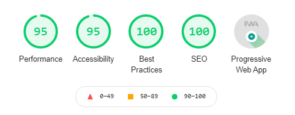

# Hambrurguer webApp

Progressive Web App creada con React, diseñada para:

1. Tomar pedidos de un establecimiento de comidas rápidas.
2. Hacer seguimiento de los pedidos en Salón - Cocina - Caja.
3. Guardar historial de pedidos.

## Proyecto

La PWA está desplegada en [Hambrurguer](https://hambrurguer-bq2.web.app/).

## Diseño del proyecto

El diseño del proyecto en: [Diseño_Figma](https://www.figma.com/file/IQKfOJ5XFLoC4SFxlka83b/Untitled?node-id=24%3A12)

## Best Practices de Lighthouse

## License
[MIT](https://choosealicense.com/licenses/mit/)

## Objetivos de aprendizaje
### HTML y CSS

- [x] [Uso de HTML semántico.](https://developer.mozilla.org/en-US/docs/Glossary/Semantics#Semantics_in_HTML)
* [x] Uso de selectores de CSS.
* [x] [Uso de flexbox en CSS.](https://css-tricks.com/snippets/css/a-guide-to-flexbox/)
* [x] [Uso de Media Queries.](https://developer.mozilla.org/es/docs/CSS/Media_queries)

### JavaScript

* [x] Uso de condicionales (if-else | switch | operador ternario)
* [x] Uso de funciones (parámetros | argumentos | valor de retorno)
* [x] Manipular arrays (filter | map | sort | reduce)
* [x] Manipular objects (key | value)
* [x] Uso ES modules ([`import`](https://developer.mozilla.org/en-US/docs/Web/JavaScript/Reference/Statements/import)
| [`export`](https://developer.mozilla.org/en-US/docs/Web/JavaScript/Reference/Statements/export))
* [x] Diferenciar entre expression y statements.
* [x] Diferenciar entre tipos de datos atómicos y estructurados.
* [x] [Uso de callbacks.](https://developer.mozilla.org/es/docs/Glossary/Callback_function)
* [x] [Consumo de Promesas.](https://scotch.io/tutorials/javascript-promises-for-dummies#toc-consuming-promises)

### Testing

* [x] [Testeo unitario.](https://jestjs.io/docs/es-ES/getting-started)

### Estructura del código y guía de estilo

* [x] Organizar y dividir el código en módulos (Modularización)
* [x] Uso de identificadores descriptivos (Nomenclatura | Semántica)
* [ ] Uso de linter (ESLINT)

### Git y Github

* [x] Uso de comandos de git (add | commit | pull | status | push)
* [x] Manejo de repositorios de GitHub (clone | fork | gh-pages)
* [x] Colaboración en Github (branches | pull requests | |tags)
* [x] Organización en Github (projects | issues | labels | milestones)

### Firebase

* [x] [Firestore.](https://firebase.google.com/docs/firestore)
* [x] [Firebase Auth.](https://firebase.google.com/docs/auth/web/start)
* [ ] [Firebase security rules.](https://firebase.google.com/docs/rules)
* [x] Observadores. ([onAuthStateChanged](https://firebase.google.com/docs/auth/web/manage-users?hl=es#get_the_currently_signed-in_user)
 | [onSnapshot](https://firebase.google.com/docs/firestore/query-data/listen#listen_to_multiple_documents_in_a_collection))

### React

* [x] [`JSX`](https://es.reactjs.org/docs/introducing-jsx.html)
* [x] [Componentes `class` y componentes `function`](https://es.reactjs.org/docs/components-and-props.html#function-and-class-components)
* [x] `props`
* [x] [Eventos en React.](https://es.reactjs.org/docs/handling-events.html)
* [x] [Listas y keys.](https://es.reactjs.org/docs/lists-and-keys.html)
* [x] [Renderizado condicional.](https://es.reactjs.org/docs/conditional-rendering.html)
* [x] [Elevación de estados.](https://es.reactjs.org/docs/lifting-state-up.html)
* [x] [`hooks`](https://es.reactjs.org/docs/hooks-intro.html)
* [x] [`CSS` modules.](https://create-react-app.dev/docs/adding-a-css-modules-stylesheet)
* [x] [React Router.](https://reacttraining.com/react-router/web)

### UX

* [x] Diseñar la aplicación pensando y entendiendo al usuario.
* [x] Crear prototipos para obtener feedback e iterar.
* [x] Aplicar los principios de diseño visual (contraste, alineación, jerarquía)
* [x] Planear y ejecutar tests de usabilidad.
